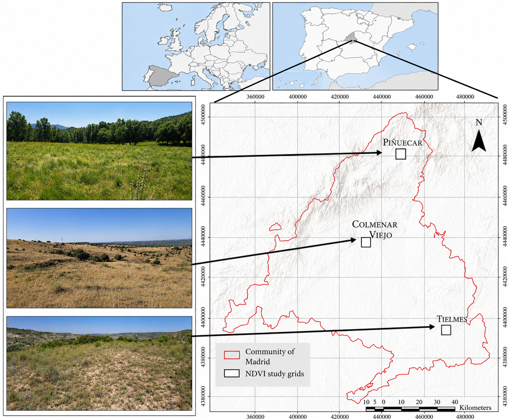
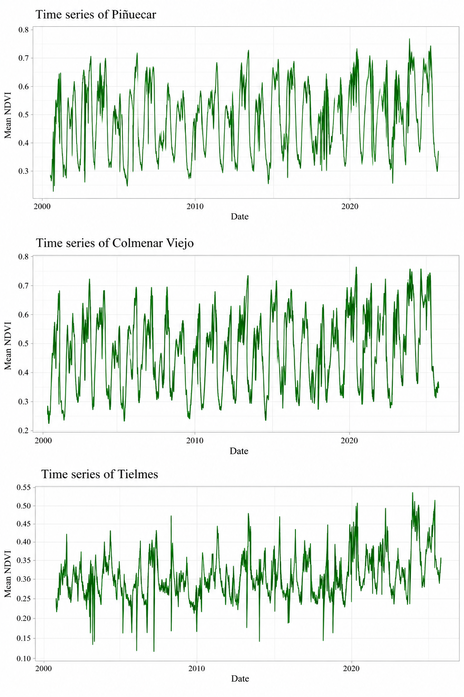
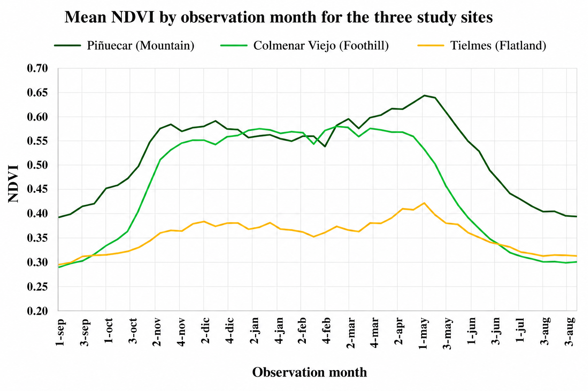
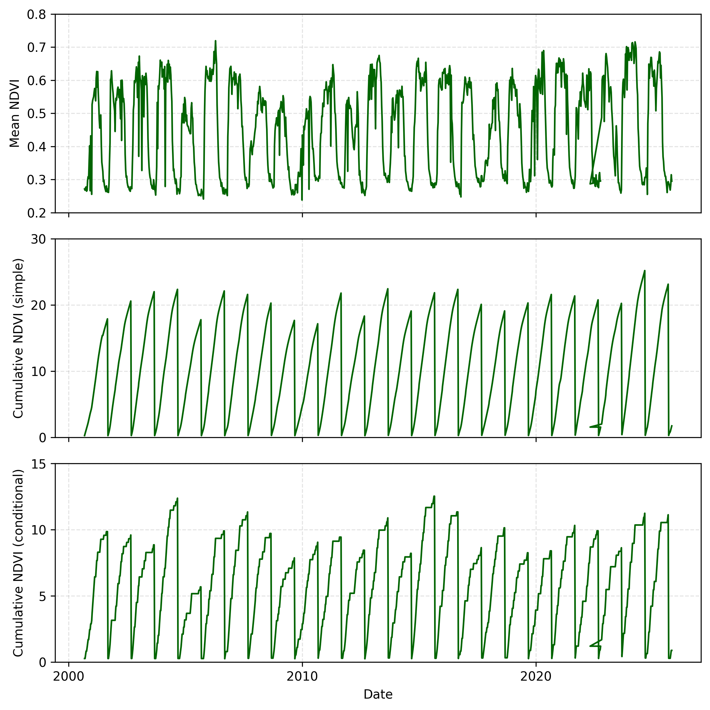

# MODIS NDVI Time-Series Analysis of Mediterranean Grasslands

## Overview

This repository presents a portfolio-oriented workflow for analysing long-term vegetation dynamics in Mediterranean grasslands using MODIS NDVI time series.

The project focuses on three grassland sites located along a climatic gradient in the Community of Madrid, Spain: **Piñuecar (Mountain)**, **Colmenar Viejo (Foothill)**, and **Tielmes (Flatland)**. The analysis explores long-term and seasonal vegetation dynamics and NDVI accumulation within hydrological years.

This public repository demonstrates the remote-sensing and environmental time-series methodology used in the research workflow. It is not a complete reproduction package and does not include the original research datasets.

## Study area

The three study sites represent contrasting Mediterranean grassland environments across the Community of Madrid.



## Study workflow

The portfolio workflow is organised around:

1. MODIS NDVI time-series preparation.
2. Assignment of observations to hydrological years beginning in September.
3. Analysis of long-term and seasonal vegetation dynamics across the three study sites.
4. Calculation of simple cumulative NDVI.
5. Calculation of conditional cumulative NDVI, where NDVI is accumulated only when the current observation is greater than or equal to the previous observation.
6. Visual comparison of vegetation behaviour across the climatic gradient.

## Long-term NDVI dynamics

The long-term time series illustrates contrasting vegetation dynamics at Piñuecar, Colmenar Viejo, and Tielmes over more than two decades of satellite observations.



## Seasonal NDVI patterns

A comparison by observation period highlights the different seasonal trajectories of the mountain, foothill, and flatland grassland systems.



## Key findings

- **Piñuecar (Mountain)** shows the highest seasonal NDVI values, with a pronounced spring maximum followed by a summer decline.
- **Colmenar Viejo (Foothill)** also displays strong seasonality, with high vegetation activity through the cool and spring growing period and a marked decline towards summer.
- **Tielmes (Flatland)** generally maintains lower NDVI values and a weaker seasonal amplitude than the other two sites.
- The contrast among the three sites illustrates how long-term satellite observations can characterise vegetation dynamics along a Mediterranean climatic gradient.
- Hydrological-year accumulation provides complementary indicators for summarising vegetation activity beyond individual NDVI observations.

These observations are descriptive interpretations of the figures included in this portfolio repository.

## NDVI accumulation methods

### Simple cumulative NDVI

NDVI observations are cumulatively summed within each hydrological year.

### Conditional cumulative NDVI

The current NDVI observation is added to the cumulative value only when it is greater than or equal to the preceding observation. Otherwise, the accumulated value remains unchanged.

Both accumulation approaches are reset at the beginning of each hydrological year (September). The figure below illustrates the original NDVI time series together with the simple and conditional accumulation approaches.



## Code organisation

The public workflow is divided into three small, reusable modules:

- `01_ndvi_time_series_processing.py` cleans dates and NDVI values, assigns hydrological years, and organises observations chronologically.
- `02_ndvi_accumulation.py` implements simple and conditional cumulative NDVI independently within each hydrological year.
- `03_ndvi_visualization.py` provides reusable functions for long-term time-series plots, seasonal summaries, and cumulative-NDVI visualisation.

## Python dependencies

The portfolio scripts use a lightweight scientific Python stack:

```text
numpy
pandas
matplotlib
```

Dependencies are also listed in `requirements.txt`.

## Repository structure

```text
MODIS-NDVI-time-series-analysis/
├── README.md
├── .gitignore
├── requirements.txt
├── data/
│   └── README.md
├── figures/
│   ├── README.md
│   ├── Figure_1.png
│   ├── Figure_2.png
│   ├── Figure_S1.png
│   └── Time_Series_3_Locations_Mean_NDVI.png
└── src/
    ├── README.md
    ├── 01_ndvi_time_series_processing.py
    ├── 02_ndvi_accumulation.py
    └── 03_ndvi_visualization.py
```

## Skills demonstrated

- Remote sensing and vegetation-index analysis
- MODIS NDVI time-series processing
- Environmental time-series analysis
- Hydrological-year aggregation
- Python data analysis with pandas and NumPy
- Scientific visualisation with Matplotlib
- Geospatial interpretation across an environmental gradient
- Reproducible organisation of research workflows

## Data availability

The original MODIS-derived research datasets are **not distributed** in this portfolio repository. The `data/` directory documents the expected data structure without publishing the underlying research data.

## Reproducibility note

The source code has been cleaned and reorganised for portfolio presentation. It demonstrates the analytical methodology but is not intended as a complete, ready-to-run reproduction of the research study.
